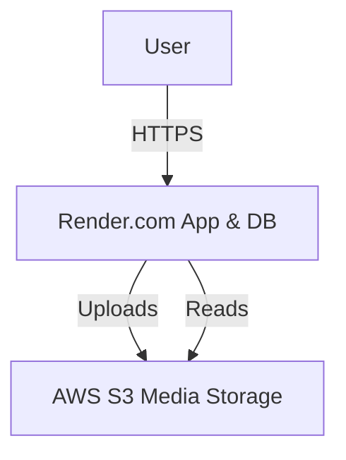

# SafariSmart Hybrid Deployment Plan
## Render + AWS S3 Architecture

**Objective:** Solve media persistence issues and optimize costs by combining Render's hosting with AWS S3 storage.

---

## Architecture Overview



### Why This Approach?
1.  **Solves Media Loss:** Render's ephemeral filesystem deletes uploads on redeploy. S3 stores them permanently.
2.  **Cost Effective:**
    *   **Render:** Free Tier (App + DB)
    *   **AWS S3:** ~$0.02/month (Pay only for storage)
3.  **Simplicity:** No complex server management (EC2) required yet.

---

## Implementation Details

### 1. AWS S3 Configuration
*   **Bucket Name:** `safarismart`
*   **Region:** `us-east-1`
*   **Access:** Public Read (via Bucket Policy)
*   **CORS:** Configured for web access

### 2. IAM Security
*   **User:** `safarismart-s3-user`
*   **Policy:** `SafariSmartS3Access` (Least Privilege)
*   **Permissions:** PutObject, GetObject, DeleteObject, ListBucket

### 3. Django Configuration
*   **Library:** `django-storages` + `boto3`
*   **Settings:**
    ```python
    DEFAULT_FILE_STORAGE = 'storages.backends.s3boto3.S3Boto3Storage'
    AWS_STORAGE_BUCKET_NAME = 'safarismart'
    ```

---

## Future Roadmap (Full AWS Migration)

When traffic grows or revenue increases, we can migrate fully to AWS:

1.  **Phase 1 (Current):** Hybrid (Render + S3)
2.  **Phase 2:** Migrate Database to AWS RDS (or SQLite on EC2)
3.  **Phase 3:** Migrate App to AWS EC2 / App Runner

---

## Cost Analysis

| Service | Plan | Cost |
|---------|------|------|
| **Render** | Free Tier | $0.00 |
| **AWS S3** | Standard | ~$0.02 |
| **Total** | | **~$0.02/mo** |
