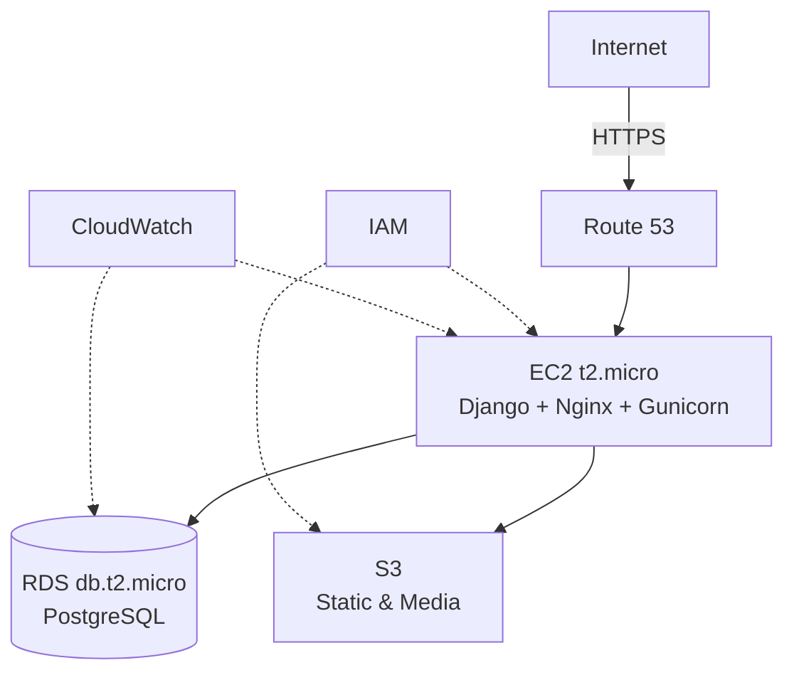

# SafariSmart AWS Deployment Plan
## AWS Well-Architected Framework Implementation

**Objective:** Deploy SafariSmart Django application to AWS using Terraform IaC while maintaining Free Tier eligibility and following AWS best practices.

---

## Architecture Overview



---

## Phase 1: Prerequisites

### 1.1 AWS Account Configuration
- Enable MFA on root account
- Create IAM admin user
- Configure AWS CLI credentials
- Enable billing alerts and Free Tier usage notifications

### 1.2 Required Tools
```bash
# Install Terraform
winget install Hashicorp.Terraform

# Install AWS CLI
winget install Amazon.AWSCLI

# Verify
terraform --version
aws --version
```

### 1.3 AWS CLI Configuration
```bash
aws configure
# Region: us-east-1
# Output: json
```

### 1.4 Billing Protection
- Set budget alert: $5/month threshold
- Enable Free Tier usage alerts
- Configure CloudWatch billing alarms

---

## Phase 2: Terraform Infrastructure

### 2.1 Directory Structure
```
terraform/
├── main.tf
├── variables.tf
├── outputs.tf
├── terraform.tfvars
├── modules/
│   ├── networking/
│   ├── compute/
│   ├── database/
│   ├── storage/
│   ├── iam/
│   └── monitoring/
├── environments/
│   ├── dev.tfvars
│   └── prod.tfvars
└── scripts/
    ├── user_data.sh
    └── deploy_app.sh
```

### 2.2 Module Specifications

#### Networking Module
**Resources:**
- VPC with CIDR 10.0.0.0/16
- Public subnet (10.0.1.0/24)
- Internet Gateway
- Route table
- Security groups:
  - SSH (22): Restricted to admin IP
  - HTTP (80): 0.0.0.0/0
  - HTTPS (443): 0.0.0.0/0
  - PostgreSQL (5432): EC2 security group only

#### Compute Module
**Instance:** t2.micro (Free Tier: 750 hrs/month)

**User Data:**
```bash
#!/bin/bash
apt-get update
apt-get install -y python3-pip python3-venv nginx postgresql-client
git clone <repository>
python3 -m venv venv
source venv/bin/activate
pip install -r requirements.txt
# Configure Nginx, Gunicorn, SSL
```

#### Database Module
**Instance:** db.t2.micro (Free Tier: 750 hrs/month)
**Storage:** 20 GB (Free Tier limit)
**Configuration:**
- Engine: PostgreSQL 14
- Encryption at rest: Enabled
- Encryption in transit: SSL required
- Public access: Disabled
- Multi-AZ: Disabled
- Automated backups: 7-day retention

#### Storage Module
**S3 Buckets:**
1. `safarismart-media` - User uploads
2. `safarismart-static` - Static assets

**Configuration:**
- Versioning: Enabled
- Encryption: AES-256
- Public access: Read-only for static files
- Lifecycle: Delete old versions after 90 days
- CORS: Configured for admin uploads

#### IAM Module
**Roles:**
- `EC2-S3-Access-Role`: EC2 instance profile
- `Django-S3-User`: Application access

**Policies (Least Privilege):**
```json
{
  "Version": "2012-10-17",
  "Statement": [
    {
      "Effect": "Allow",
      "Action": ["s3:PutObject", "s3:GetObject", "s3:DeleteObject"],
      "Resource": "arn:aws:s3:::safarismart-media/*"
    }
  ]
}
```

#### Monitoring Module
**CloudWatch Alarms:**
- CPU utilization > 80% for 5 minutes
- Disk usage > 80%
- RDS connections > 80% of max
- Estimated monthly charges > $5

---

## Phase 3: Security Configuration

### 3.1 Security Checklist
- Enable AWS CloudTrail
- Enable VPC Flow Logs
- Configure security groups (least privilege)
- Use IAM roles (no hardcoded credentials)
- Enable RDS encryption
- Enable S3 encryption
- Configure SSL/TLS (Let's Encrypt)
- Implement credential rotation policy

### 3.2 Secrets Management
**AWS Systems Manager Parameter Store:**
```hcl
resource "aws_ssm_parameter" "django_secret_key" {
  name  = "/safarismart/prod/DJANGO_SECRET_KEY"
  type  = "SecureString"
  value = var.django_secret_key
}
```

**Django Integration:**
```python
import boto3
ssm = boto3.client('ssm', region_name='us-east-1')
SECRET_KEY = ssm.get_parameter(
    Name='/safarismart/prod/DJANGO_SECRET_KEY',
    WithDecryption=True
)['Parameter']['Value']
```

---

## Phase 4: Deployment Process

### 4.1 Infrastructure Deployment
```bash
cd terraform
terraform init
terraform validate
terraform plan -out=tfplan
terraform apply tfplan
terraform output
```

### 4.2 Application Deployment
```bash
ssh -i safarismart-key.pem ubuntu@<ec2-ip>
cd /opt/safarismart
git pull origin main
source venv/bin/activate
pip install -r requirements.txt
python manage.py migrate
python manage.py collectstatic --noinput
sudo systemctl restart gunicorn nginx
```

### 4.3 Database Initialization
```bash
python manage.py migrate
python manage.py loaddata fixtures/initial_data.json
python manage.py createsuperuser
```

---

## Phase 5: Monitoring & Maintenance

### 5.1 Daily Operations
- Monitor AWS Free Tier usage dashboard
- Review CloudWatch alarms
- Check application logs
- Verify automated backups

### 5.2 Weekly Operations
- Review cost and usage reports
- Audit security group rules
- Review CloudTrail logs
- Test disaster recovery procedures

### 5.3 Monthly Operations
- Review IAM access
- Rotate credentials
- Update dependencies
- Optimize resource utilization

---

## Phase 6: Cost Management

### 6.1 Free Tier Resource Allocation

| Service | Free Tier Limit | Allocated | Status |
|---------|----------------|-----------|--------|
| EC2 t2.micro | 750 hrs/mo | 720 hrs/mo | Within limit |
| RDS db.t2.micro | 750 hrs/mo | 720 hrs/mo | Within limit |
| EBS Storage | 30 GB | 20 GB | Within limit |
| RDS Storage | 20 GB | 20 GB | At limit |
| S3 Storage | 5 GB | 2 GB | Within limit |
| Data Transfer OUT | 100 GB/mo | ~10 GB/mo | Within limit |

### 6.2 Cost Optimization
**Development Environment:**
```bash
terraform destroy -target=module.dev_environment
terraform apply -target=module.dev_environment
```

**Budget Configuration:**
```hcl
resource "aws_budgets_budget" "monthly_cost" {
  name              = "monthly-cost-budget"
  budget_type       = "COST"
  limit_amount      = "5"
  limit_unit        = "USD"
  time_unit         = "MONTHLY"
  
  notification {
    comparison_operator        = "GREATER_THAN"
    threshold                  = 80
    threshold_type             = "PERCENTAGE"
    notification_type          = "ACTUAL"
    subscriber_email_addresses = ["admin@safarismart.co.ke"]
  }
}
```

---

## Phase 7: Disaster Recovery

### 7.1 Backup Strategy
**RDS:**
- Automated daily backups
- 7-day retention period
- Backup window: 03:00-04:00 UTC

**S3:**
- Versioning enabled
- 90-day version retention
- Cross-region replication (optional)

**Application:**
- Git repository with tagged releases
- Infrastructure as Code in version control

### 7.2 Recovery Procedures

**EC2 Instance Failure:**
```bash
terraform taint module.compute.aws_instance.app_server
terraform apply
```

**Database Corruption:**
```bash
aws rds restore-db-instance-from-db-snapshot \
  --db-instance-identifier safarismart-restored \
  --db-snapshot-identifier <snapshot-id>
```

**S3 Object Recovery:**
```bash
aws s3api list-object-versions --bucket safarismart-media --prefix <path>
aws s3api get-object --bucket safarismart-media --key <key> --version-id <id> <output>
```

---

## AWS Well-Architected Framework Compliance

### Operational Excellence
- Infrastructure as Code (Terraform)
- Automated deployments
- Centralized logging (CloudWatch)
- Monitoring and alerting

### Security
- Encryption at rest and in transit
- IAM least privilege policies
- Network isolation (VPC, Security Groups)
- Secrets management (Parameter Store)
- Audit logging (CloudTrail)

### Reliability
- Automated backups
- Multi-AZ capability (disabled for cost)
- Health monitoring
- Disaster recovery procedures

### Performance Efficiency
- Right-sized instances (t2.micro)
- S3 for static content delivery
- Database query optimization
- Application-level caching

### Cost Optimization
- Free Tier maximization
- Resource tagging
- Budget alerts
- Automated resource cleanup

### Sustainability
- Minimal resource footprint
- Efficient instance sizing
- Lifecycle policies for data retention

---

## Documentation References

### AWS Services
- [EC2 Documentation](https://docs.aws.amazon.com/ec2/)
- [RDS Documentation](https://docs.aws.amazon.com/rds/)
- [S3 Documentation](https://docs.aws.amazon.com/s3/)
- [IAM Best Practices](https://docs.aws.amazon.com/IAM/latest/UserGuide/best-practices.html)

### Well-Architected Framework
- [Framework Overview](https://aws.amazon.com/architecture/well-architected/)
- [Operational Excellence](https://docs.aws.amazon.com/wellarchitected/latest/operational-excellence-pillar/)
- [Security](https://docs.aws.amazon.com/wellarchitected/latest/security-pillar/)
- [Reliability](https://docs.aws.amazon.com/wellarchitected/latest/reliability-pillar/)
- [Performance Efficiency](https://docs.aws.amazon.com/wellarchitected/latest/performance-efficiency-pillar/)
- [Cost Optimization](https://docs.aws.amazon.com/wellarchitected/latest/cost-optimization-pillar/)

### Terraform
- [AWS Provider Documentation](https://registry.terraform.io/providers/hashicorp/aws/latest/docs)
- [Terraform Best Practices](https://www.terraform-best-practices.com/)

---

## Implementation Timeline

**Day 1:** Prerequisites and AWS account setup
**Day 2-3:** Terraform module development
**Day 3:** Security configuration
**Day 4:** Initial deployment and testing
**Ongoing:** Monitoring, maintenance, and optimization

---

## Next Steps

1. Review and approve architecture
2. Set up AWS prerequisites
3. Develop Terraform modules
4. Deploy to development environment
5. Test and validate
6. Deploy to production
7. Implement monitoring and maintenance procedures
