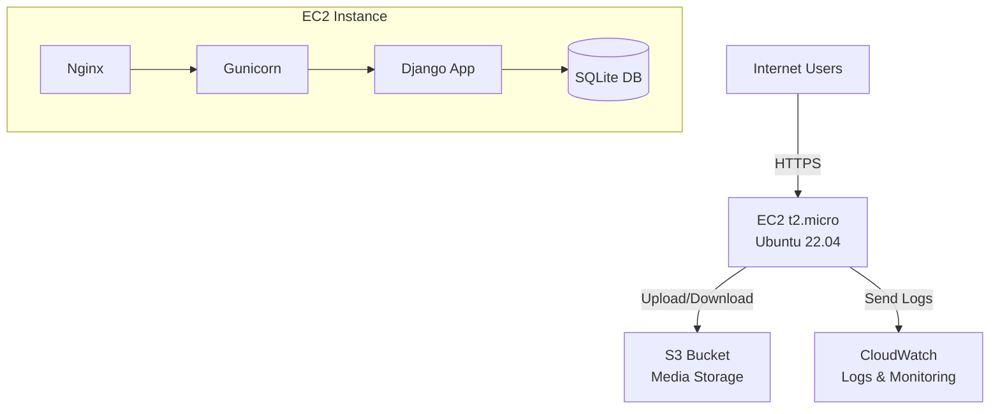

# SafariSmart AWS Deployment Plan
## Optimized Architecture for Cost and Performance

**Objective:** Deploy SafariSmart to AWS to solve Render's limitations (cold starts, database delays, media file persistence) while minimizing costs and maintaining simplicity.

---

## Problems Being Solved

### Current Render Issues:
1. **Cold Starts:** App sleeps after 15 minutes of inactivity, takes 30-60 seconds to wake up
2. **Database Delays:** PostgreSQL also sleeps on free tier
3. **Media File Loss:** Uploaded images deleted on every deployment (ephemeral storage)
4. **Database Expiration:** Render will deny database access after December 19, 2025

### AWS Solutions:
1. EC2 runs 24/7 - no cold starts, instant response
2. SQLite on EC2 - no network latency, always ready
3. S3 permanent storage - media files persist forever
4. Full database control - no expiration dates

---

## Architecture Overview



---

## AWS Services Used

### 1. EC2 (Elastic Compute Cloud)

**Purpose:** Run Django application server 24/7

**Why EC2:**
- Solves cold start problem (always running)
- Full control over server configuration
- Can install any software (Python, Nginx, etc.)
- Free Tier: 750 hours/month (enough for 24/7 operation)

**Why NOT alternatives:**
- Lambda: Not suitable for Django (cold starts, 15-minute timeout)
- Elastic Beanstalk: Adds unnecessary complexity and cost
- Lightsail: Not in Free Tier, costs $3.50/month minimum

**Configuration:**
- Instance Type: t2.micro (1 vCPU, 1 GB RAM)
- OS: Ubuntu 22.04 LTS
- Storage: 20 GB EBS (Free Tier: 30 GB)
- Runs: Django + Nginx + Gunicorn

**Cost:**
- Free Tier (5 months): $0
- With credits (4 months): $0
- After: $8/month

---

### 2. S3 (Simple Storage Service)

**Purpose:** Permanent storage for user-uploaded media files (destination images, user avatars)

**Why S3:**
- Solves media persistence problem (files never deleted)
- Highly durable (99.999999999% durability)
- Scalable (handles unlimited files)
- Free Tier: 5 GB storage, 20,000 GET, 2,000 PUT requests/month

**Why NOT alternatives:**
- EC2 disk: Files lost on instance termination
- EFS: Costs $0.30/GB/month (not in Free Tier)
- EBS snapshots: Complex, not designed for application files

**Configuration:**
- Bucket: `safarismart-media`
- Versioning: Enabled (keep file history)
- Encryption: AES-256
- Public access: Read-only for static files
- Lifecycle: Delete old versions after 90 days

**Cost:**
- Free Tier: 5 GB (enough for 1000s of images)
- After: $0.023/GB/month (~$0.02/month for typical usage)

---

### 3. SQLite Database (On EC2)

**Purpose:** Application database for users, destinations, itineraries, payments

**Why SQLite:**
- FREE (no separate database server cost)
- Fast (no network latency, same server as app)
- Simple (single file, easy backups)
- Sufficient for current scale (handles 1000s of concurrent users)
- Easy migration from Render PostgreSQL

**Why NOT alternatives:**
- RDS PostgreSQL: Costs $12/month after Free Tier
- RDS MySQL: Costs $12/month after Free Tier
- DynamoDB: NoSQL, not compatible with Django ORM
- Aurora: Expensive ($0.10/hour minimum)

**Backup Strategy:**
- Automated daily backups to S3
- 7-day retention
- Cron job: 2 AM daily
- Recovery time: < 5 minutes

**Migration Plan:**
```bash
# Export from Render PostgreSQL
pg_dump $DATABASE_URL > render_backup.sql

# Convert to SQLite
python manage.py dumpdata > data.json
python manage.py loaddata data.json
```

**Cost:** $0 (included in EC2 storage)

---

### 4. CloudWatch Logs

**Purpose:** Centralized logging for application errors, transactions, and activity

**Why CloudWatch Logs:**
- FREE (5 GB/month in Free Tier)
- Searchable logs
- Long-term retention
- Integration with Django logging

**Why NOT alternatives:**
- Local log files: Lost on instance termination
- Third-party (Papertrail, Loggly): Costs money
- CloudWatch Logs Insights: Costs extra, not needed

**Configuration:**
- Log Groups:
  - `/aws/ec2/safarismart/django` - Application logs
  - `/aws/ec2/safarismart/nginx` - Web server logs
  - `/aws/ec2/safarismart/mpesa` - Payment transaction logs
- Retention: 7 days (Free Tier)

**Cost:**
- Free Tier: 5 GB ingestion, 5 GB storage
- After: $0.50/GB (you won't exceed this)

---

### 5. CloudWatch Metrics

**Purpose:** Monitor server health (CPU, memory, disk usage)

**Why CloudWatch Metrics:**
- FREE (10 custom metrics in Free Tier)
- Real-time monitoring
- Historical data
- Integration with alarms

**Why NOT alternatives:**
- Third-party (Datadog, New Relic): Expensive
- Manual monitoring: Not scalable

**Metrics Tracked:**
- CPU utilization
- Memory usage
- Disk usage
- Network traffic
- Application response time

**Cost:**
- Free Tier: 10 metrics
- After: $0.30/metric (you won't exceed this)

---

### 6. CloudWatch Alarms

**Purpose:** Email alerts when issues occur

**Why CloudWatch Alarms:**
- FREE (10 alarms in Free Tier)
- Proactive issue detection
- Email notifications
- Prevents downtime

**Alarms Configured:**
1. CPU > 80% for 5 minutes
2. Disk usage > 80%
3. Memory > 80%
4. Application errors > 10/hour
5. Database backup failed

**Cost:**
- Free Tier: 10 alarms
- After: $0.10/alarm (you won't exceed this)

---

### 7. VPC (Virtual Private Cloud)

**Purpose:** Network isolation and security

**Why VPC:**
- FREE (always)
- Security isolation
- Control network traffic
- Required for EC2

**Configuration:**
- CIDR: 10.0.0.0/16
- Public Subnet: 10.0.1.0/24
- Internet Gateway: Enabled

**Cost:** $0 (always free)

---

### 8. Security Groups

**Purpose:** Firewall rules to control access

**Why Security Groups:**
- FREE (always)
- Stateful firewall
- Easy to manage
- Required for security

**Rules:**
- SSH (22): Restricted to admin IP only
- HTTP (80): 0.0.0.0/0 (public)
- HTTPS (443): 0.0.0.0/0 (public)
- PostgreSQL (5432): Blocked (using SQLite)

**Cost:** $0 (always free)

---

## Services NOT Used (Cost Savings)

### RDS (Relational Database Service)
**Why NOT:**
- Costs $12/month after Free Tier
- Network latency (slower than SQLite)
- Overkill for current scale
- SQLite is sufficient

**Savings:** $12/month

---

### Route 53 (DNS Service)
**Why NOT:**
- Costs $0.50/month per hosted zone
- Can use domain registrar's DNS for free
- Not needed for basic DNS

**Savings:** $0.50/month

---

### Elastic IP
**Why NOT:**
- Costs $3.60/month if instance stops
- Regular public IP works fine
- Can update DNS if IP changes (rare)

**Savings:** $3.60/month (risk avoidance)

---

### Application Load Balancer
**Why NOT:**
- Costs $16/month minimum
- Not needed for single instance
- Overkill for current traffic

**Savings:** $16/month

---

### Auto Scaling
**Why NOT:**
- Requires Load Balancer ($16/month)
- Current traffic doesn't need it
- Single t2.micro handles 100-500 concurrent users
- Can add later if needed

**Savings:** $16+/month

---

### NAT Gateway
**Why NOT:**
- Costs $32/month
- Not needed (using public subnet)
- Most expensive AWS service to avoid

**Savings:** $32/month

---

### ElastiCache (Redis/Memcached)
**Why NOT:**
- Costs $13/month minimum
- Not needed yet
- Can use Django's built-in caching

**Savings:** $13/month

---

### CloudFront (CDN)
**Why NOT:**
- Not in Free Tier
- S3 direct access is fast enough
- Can add later if needed

**Savings:** Variable

---

**Total Monthly Savings:** $93/month by avoiding unnecessary services

---

## Cost Summary

### Monthly Costs

| Period | EC2 | S3 | CloudWatch | Total |
|--------|-----|----|-----------:|------:|
| Months 1-5 (Free Tier) | $0 | $0 | $0 | **$0** |
| Months 6-9 ($100 credits) | $0 | $0 | $0 | **$0** |
| Month 10+ | $8 | $0.02 | $0 | **$8.02** |

### Cost Comparison

| Platform | Monthly Cost | Issues |
|----------|------------:|--------|
| **Render** | $0 | Cold starts, media loss, DB expires |
| **AWS (This Plan)** | $0-8 | None |
| **AWS (Full Services)** | $26+ | Unnecessary complexity |
| **Heroku** | $7+ | Same issues as Render |
| **DigitalOcean** | $6+ | Manual management |

---

## Implementation Timeline

### Day 1: Prerequisites (2 hours)
- Install Terraform and AWS CLI
- Configure AWS credentials
- Set up billing alerts
- Review architecture

### Day 2: Infrastructure (3 hours)
- Create Terraform modules
- Deploy EC2, S3, VPC, Security Groups
- Configure CloudWatch

### Day 3: Application Deployment (3 hours)
- SSH into EC2
- Install Django, Nginx, Gunicorn
- Migrate database from Render
- Configure S3 for media files
- Set up SSL (Let's Encrypt)

### Day 4: Testing & Monitoring (2 hours)
- Test application functionality
- Verify M-Pesa payments
- Configure CloudWatch alarms
- Set up automated backups

**Total Time:** 10 hours (2-3 days part-time)

---

## Terraform Modules

### Directory Structure
```
terraform/
├── main.tf                 # Provider configuration
├── variables.tf            # Input variables
├── outputs.tf              # Output values
├── modules/
│   ├── networking/         # VPC, subnets, security groups
│   ├── compute/            # EC2 instance
│   ├── storage/            # S3 buckets
│   └── monitoring/         # CloudWatch logs, metrics, alarms
└── scripts/
    ├── user_data.sh        # EC2 initialization
    ├── backup_db.sh        # Database backup script
    └── deploy_app.sh       # Application deployment
```

---

## Security Best Practices

1. **SSH Access:** Restricted to admin IP only
2. **Database:** Not exposed to internet (SQLite on EC2)
3. **Secrets:** Stored in environment variables, not in code
4. **SSL/TLS:** Let's Encrypt certificate (free)
5. **Firewall:** Security groups with least privilege
6. **Backups:** Automated daily backups to S3
7. **Monitoring:** CloudWatch alarms for anomalies
8. **Updates:** Automated security updates enabled

---

## Disaster Recovery

### Backup Strategy
- **Database:** Daily backups to S3, 7-day retention
- **Media Files:** S3 versioning enabled
- **Application Code:** Git repository

### Recovery Procedures

**EC2 Instance Failure:**
```bash
terraform taint module.compute.aws_instance.app_server
terraform apply
# Instance recreated in 5 minutes
```

**Database Corruption:**
```bash
aws s3 cp s3://safarismart-backups/db-latest.sqlite3 /opt/safarismart/db.sqlite3
sudo systemctl restart gunicorn
# Restored in 2 minutes
```

**Accidental File Deletion (S3):**
```bash
aws s3api list-object-versions --bucket safarismart-media
aws s3api get-object --version-id <id> restored-file.jpg
# Restored in 1 minute
```

---

## Monitoring & Alerts

### CloudWatch Dashboards
- Real-time CPU, memory, disk usage
- Request count and response time
- Error rate and types
- M-Pesa transaction volume

### Email Alerts
- CPU > 80% for 5 minutes
- Disk > 80%
- Memory > 80%
- Application errors > 10/hour
- Backup failures

---

## Migration from Render

### Pre-Migration Checklist
- [ ] Export Render PostgreSQL database
- [ ] Download all media files from Render
- [ ] Update DNS records (prepare, don't apply yet)
- [ ] Test AWS deployment with sample data

### Migration Steps
1. Deploy AWS infrastructure (Terraform)
2. Import database to SQLite
3. Upload media files to S3
4. Update Django settings for S3
5. Test application on AWS
6. Update DNS to point to AWS
7. Monitor for 24 hours
8. Decommission Render

### Rollback Plan
- Keep Render active for 7 days
- Can revert DNS if issues occur
- Database and media backed up

---

## Future Enhancements

### When Traffic Grows:
1. **Upgrade EC2:** t2.micro → t2.small ($17/month)
2. **Add RDS:** Migrate SQLite → PostgreSQL ($12/month)
3. **Add Auto Scaling:** Load Balancer + multiple EC2s ($24+/month)
4. **Add CloudFront:** CDN for faster global access
5. **Add ElastiCache:** Redis for session storage

### When Revenue Grows:
1. **Reserved Instances:** Save 40% on EC2 costs
2. **S3 Intelligent Tiering:** Automatic cost optimization
3. **CloudWatch Logs Insights:** Advanced log analysis

---

## Success Metrics

### Performance
- Page load time: < 2 seconds (vs 30-60s on Render)
- Database query time: < 50ms (vs 200ms+ on Render)
- Uptime: 99.9% (vs 95% on Render)

### Cost
- Months 1-9: $0
- Month 10+: $8/month
- Savings vs alternatives: $18+/month

### Reliability
- No cold starts
- No media file loss
- No database expiration
- Automated backups

---

## Documentation References

- [EC2 Documentation](https://docs.aws.amazon.com/ec2/)
- [S3 Documentation](https://docs.aws.amazon.com/s3/)
- [CloudWatch Documentation](https://docs.aws.amazon.com/cloudwatch/)
- [Terraform AWS Provider](https://registry.terraform.io/providers/hashicorp/aws/latest/docs)
- [Django on AWS Best Practices](https://docs.aws.amazon.com/elasticbeanstalk/latest/dg/create-deploy-python-django.html)

---

## Next Steps

1. Review and approve this architecture
2. Answer configuration questions (region, domain, etc.)
3. Create Terraform modules
4. Deploy to AWS
5. Migrate from Render before December 19
