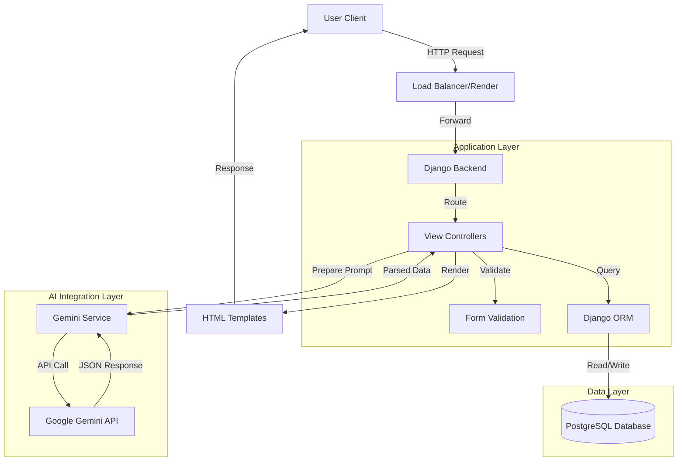
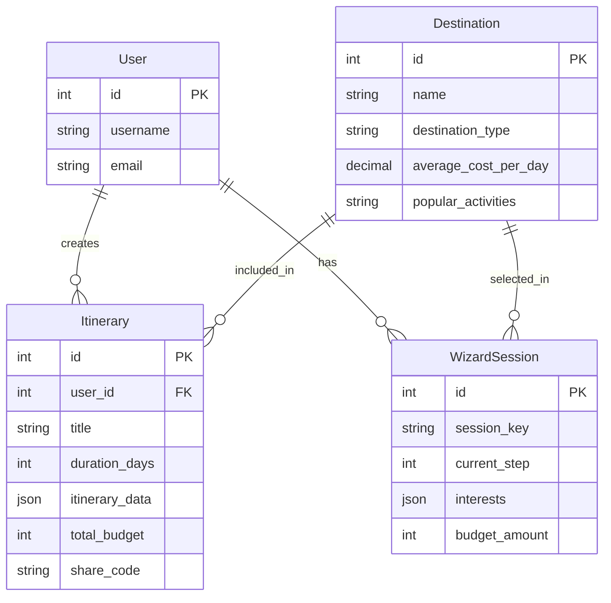

# SafariSmart Kenya

**AI-Powered Safari and Travel Planning Platform**

[](https://safarismart-kenya.onrender.com)
[](https://www.python.org/)
[](https://www.djangoproject.com/)
[](LICENSE)

---

## Project Overview

**SafariSmart Kenya** is a travel platform designed to modernize how users plan their Kenyan safaris. By integrating **Google's Gemini AI**, the system generates personalized, budget-conscious, and interest-based itineraries. The platform aims to promote domestic tourism by making travel planning accessible and transparent.

### Mission
To democratize travel planning in Kenya, enabling users to discover destinations and plan affordable trips through intelligent automation.

---

## System Architecture

The following diagram illustrates the high-level architecture of the SafariSmart Kenya platform, detailing the data flow between the user, the Django backend, and the external Gemini AI service.



---

## Database Schema

The application uses a relational database to manage users, destinations, and generated itineraries. The core relationships are depicted below.



---

## Key Features

- **AI-Powered Itinerary Generator**: Utilizes Generative AI to create day-by-day travel plans based on user constraints (budget, group size, interests).
- **Destination Management**: A curated database of over 20 Kenyan destinations with detailed metadata (costs, activities, weather).
- **Wizard-Based Interface**: A multi-step form that guides users through the planning process, storing progress in `WizardSession` to prevent data loss.
- **Security Implementation**:
    - **Brute-force Protection**: Implemented via `django-axes`.
    - **Content Security Policy**: Enforced using `django-csp`.
    - **Rate Limiting**: Applied to API endpoints to prevent abuse.
- **Responsive Design**: Built with Bootstrap 5 and SCSS for a consistent experience across devices.

---

## Technology Stack

- **Backend Framework**: Django 5.0 (Python 3.11)
- **AI Service**: Google Generative AI (Gemini Pro)
- **Database**: PostgreSQL (Production), SQLite (Development)
- **Frontend**: HTML5, SCSS, Bootstrap 5, JavaScript
- **Security Libraries**: Argon2, Bleach, Django-CSP, Django-Axes
- **Deployment Platform**: Render.com

---

## Installation and Setup

### Prerequisites
- Python 3.11 or higher
- Git
- Virtualenv

### Step-by-Step Installation

1.  **Clone the Repository**
    ```bash
    git clone https://github.com/owuorviny109/safarismart-kenya.git
    cd safarismart-kenya
    ```

2.  **Create and Activate Virtual Environment**
    ```bash
    python -m venv venv
    # Windows
    venv\Scripts\activate
    # Linux/Mac
    source venv/bin/activate
    ```

3.  **Install Dependencies**
    ```bash
    pip install -r requirements.txt
    ```

4.  **Environment Configuration**
    Create a `.env` file in the root directory with the following variables:
    ```env
    DEBUG=True
    SECRET_KEY=your-secure-secret-key
    GEMINI_API_KEY=your-google-gemini-api-key
    OPENWEATHER_API_KEY=your-openweather-api-key
    DATABASE_URL=sqlite:///db.sqlite3
    ```

5.  **Apply Database Migrations**
    ```bash
    python manage.py migrate
    ```

6.  **Load Initial Configuration Data**
    This script populates the database with default travel types, budget categories, and system settings.
    ```bash
    python manage.py shell < load_config_data.py
    ```

7.  **Start the Development Server**
    ```bash
    python manage.py runserver
    ```

---

## Code Structure

```text
safarismart-kenya/
├── accounts/                   # User authentication & profile management
│   ├── forms.py                # Login, Registration, and Profile forms
│   ├── models.py               # User profile models
│   ├── urls.py                 # Account-related URL routing
│   └── views.py                # Authentication logic (Login, Logout, Register)
├── api/                        # Internal API endpoints
│   ├── urls.py                 # API URL routing
│   └── views.py                # API view logic (e.g., dynamic data fetching)
├── core/                       # Core application logic
│   ├── management/             # Custom Django management commands
│   ├── middleware/             # Custom middleware (e.g., analytics)
│   ├── services/               # Business logic services (AI, Email, etc.)
│   ├── templatetags/           # Custom template tags and filters
│   ├── models.py               # Core models (WizardSession, Itinerary)
│   ├── models_config.py        # System configuration models
│   ├── urls.py                 # Core URL routing
│   └── views.py                # Main views (Landing, Dashboard, Wizard)
├── destinations/               # Destination management
│   ├── models.py               # Destination models
│   ├── urls.py                 # Destination URL routing
│   └── views.py                # Destination listing and detail views
├── safarismart/                # Project configuration
│   ├── settings.py             # Main Django settings
│   ├── settings_production.py  # Production-specific settings
│   ├── urls.py                 # Root URL configuration
│   └── wsgi.py                 # WSGI application entry point
├── static/                     # Static assets
│   ├── css/                    # Compiled CSS files
│   ├── images/                 # Project images
│   └── js/                     # JavaScript files
├── templates/                  # HTML Templates
│   ├── accounts/               # Authentication templates
│   ├── components/             # Reusable UI components (Navbar, Footer)
│   ├── core/                   # Core templates (Landing, Dashboard)
│   ├── destinations/           # Destination templates
│   └── base.html               # Base template with common layout
├── .gitignore                  # Git exclusion rules
├── build.sh                    # Render.com build script
├── db.sqlite3                  # Development database
├── FAQ.md                      # Frequently Asked Questions
├── load_config_data.py         # Database seeding script
├── manage.py                   # Django management utility
├── package.json                # Frontend dependencies
├── README.md                   # Project documentation
├── render.yaml                 # Render.com infrastructure config
├── requirements.txt            # Python dependencies
└── USER_GUIDE.md               # User instruction manual
```

---

## Production Deployment

### AWS Infrastructure (Planned)

For production deployment to AWS using Infrastructure as Code (Terraform), refer to:

**[AWS_DEPLOYMENT_PLAN.md](AWS_DEPLOYMENT_PLAN.md)**

This comprehensive deployment plan covers:
- AWS Well-Architected Framework implementation
- Terraform infrastructure modules (EC2, RDS, S3, IAM)
- Security configuration and best practices
- Cost optimization within AWS Free Tier
- Monitoring and disaster recovery procedures

**Status:** Planned for implementation after core functionality completion.

**Current Deployment:** Render.com (see `render.yaml` for configuration)

---

## Documentation

- **[FAQ.md](FAQ.md)** - Frequently Asked Questions
- **[USER_GUIDE.md](USER_GUIDE.md)** - User instruction manual
- **[CHANGELOG.md](CHANGELOG.md)** - Version history and release notes
- **[AWS_DEPLOYMENT_PLAN.md](AWS_DEPLOYMENT_PLAN.md)** - Production deployment guide

---

## Contributing

Contributions are welcome. Please follow the standard fork-and-pull request workflow:
1.  Fork the repository.
2.  Create a feature branch.
3.  Commit your changes with clear messages.
4.  Push to your branch.
5.  Open a Pull Request describing your changes.

---

## Contact

**Vincent Owuor**
- GitHub: [@owuorviny109](https://github.com/owuorviny109)
- Email: owuorvincent069@gmail.com
- Portfolio: [owuorvincent.vercel.app](https://owuorvincent.vercel.app/)
