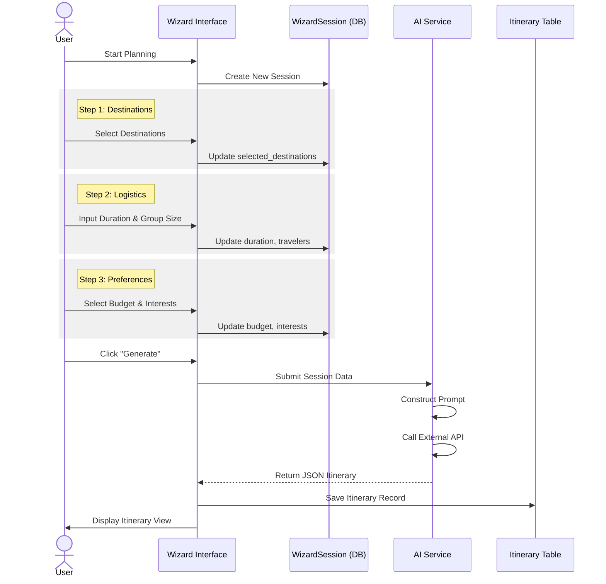

# User Guide: Generating Safari Itineraries

This guide outlines the process of using the SafariSmart Kenya platform to generate personalized safari itineraries. It details the steps required, the underlying logic, and troubleshooting advice.

---

## Prerequisites

To utilize the itinerary generation feature, the following conditions must be met:
1.  **Registered Account**: Users must create an account and log in to save and retrieve itineraries.
2.  **System Configuration**: The system must have active API keys for Google Gemini and OpenWeatherMap (handled by the administrator).

---

## Itinerary Generation Workflow

The itinerary generation process follows a multi-step "Wizard" pattern. The system captures user preferences at each stage before submitting the aggregated data to the AI engine.

---

## Step-by-Step Instructions

### 1. Accessing the Dashboard
Upon logging in, navigate to the user dashboard. This is the central hub for managing trips. Select the **"Plan New Trip"** option to initiate the wizard.

### 2. The Planning Wizard
The wizard guides you through four key configuration steps:

#### Step 1: Destination Selection
Choose from the available list of curated destinations. You may select multiple locations. The system will attempt to route the itinerary through all selected points.

#### Step 2: Trip Logistics
Provide the core details of the trip:
-   **Duration**: The total number of days.
-   **Start Date**: The intended date of arrival.
-   **Travelers**: The number of adults and children.

#### Step 3: Budget and Style
Define the financial and experiential parameters:
-   **Travel Style**: Options include Solo, Couple, Family, or Friends.
-   **Budget Category**:
    -   *Budget*: Minimalist accommodation and transport.
    -   *Mid-Range*: Standard lodges and comfort.
    -   *Luxury*: Premium resorts and private charters.

#### Step 4: Interests
Select specific interests (e.g., Wildlife, Photography, Culture) to tailor the activities suggested by the AI.

### 3. Generation and Review
After submitting the form, the system processes the request. This may take 10-30 seconds. Do not refresh the page during this process.

Once complete, the detailed itinerary will be displayed, including:
-   Day-by-day activity breakdown.
-   Accommodation recommendations.
-   Estimated cost analysis.

The itinerary is automatically saved to your account under "My Trips".

---

## Troubleshooting

### Generation Failures
If the system fails to generate an itinerary, consider the following:
-   **Complexity**: Reducing the number of selected destinations or interests can help the AI generate a valid response.
-   **Budget Constraints**: If the selected budget is too low for the chosen duration and luxury level, the AI may fail to find suitable options. Try increasing the budget category.

### Display Issues
Ensure that your browser supports modern JavaScript and that no ad-blockers are interfering with the application's scripts.

